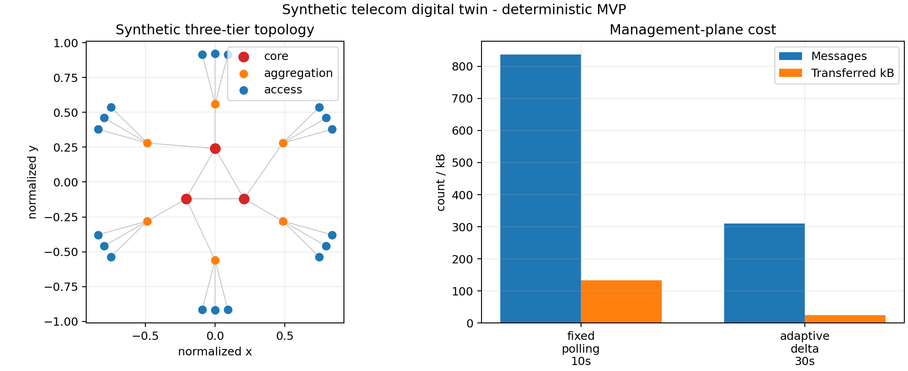
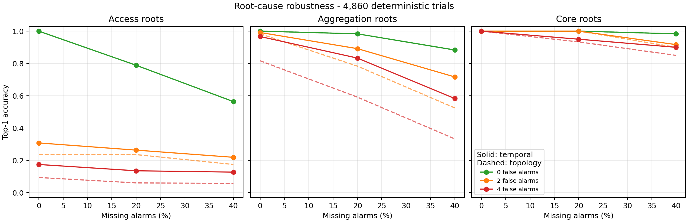

# Telecom Network Digital Twin

A reproducible synthetic telecom-network operations project with hierarchical
topology generation, deterministic telemetry, congestion incident injection,
alarm analysis, management-protocol simulation, and a FastAPI read API.



> This is an independent portfolio reconstruction using synthetic identifiers,
> parameters, topology, and telemetry. It contains no employer code, operator
> data, production endpoints, credentials, or proprietary protocol details.

## Phase 1 scope

- Deterministic 3-core / 6-aggregation / 18-access topology.
- 301 seconds of one-second telemetry for 27 synthetic nodes.
- Reproducible congestion incident on `access-07` from 123 to 183 seconds.
- Threshold alarms for latency and packet loss.
- Fixed 10-second full polling versus adaptive delta telemetry with a
  30-second heartbeat.
- FastAPI endpoints for health, topology, latest telemetry, alarms, and
  protocol-experiment results.
- CSV artifacts, a deterministic summary figure, unit tests, and GitHub CI.
- Topology-aware root-cause ranking for access, aggregation, and core fault
  propagation with deterministic missing and false alarms.

## Quantitative result

The included 301-second run generates 8,127 samples and 115 threshold alarms.
Both communication strategies detect the injected alarm episode. Compared
with 10-second fixed polling, the adaptive delta strategy:

| Metric | Fixed polling | Adaptive delta | Change |
|---|---:|---:|---:|
| Messages | 837 | 310 | -63.0% |
| Transferred data | 133.9 kB | 24.8 kB | -81.5% |
| First detection delay | 4 s | 0 s | -4 s |
| Mean telemetry staleness | 4.49 s | 13.38 s | +8.89 s |
| P95 telemetry staleness | 9 s | 27 s | +18 s |

This is an explicit bandwidth/freshness tradeoff: adaptive updates reduce
management-plane traffic and react immediately to the injected change, but
unchanged metrics can remain older between 30-second heartbeats.

## Root-cause localization

Phase 2 adds access congestion, aggregation degradation, and core-node failure
scenarios. Alarm observations contain deterministic missing and false alarms.
A transparent topology-aware score balances observed-alarm recall, predicted
impact precision, and whether the candidate itself alarms. The true root ranks
first in all three included scenarios (Top-1 and Top-3 accuracy both 100%).
This small synthetic evaluation demonstrates the method but is not evidence of
production fault-localization accuracy.

## Monte Carlo robustness benchmark

Phase 3 expands the evaluation to **4,860 deterministic trials**: all 27 nodes
as possible roots, 0/20/40% missing alarms, 0/2/4 false alarms, and 20 seeded
repeats per combination. A temporal model assumes downstream alarms propagate
three seconds per hierarchy hop and compares this signal with topology-only
ranking.

| Metric (role-macro average) | Topology only | Topology + time |
|---|---:|---:|
| Top-1 accuracy | 69.56% | **74.75%** |
| Top-3 accuracy | 84.66% | **87.85%** |
| Worst-noise Top-1 | 41.39% | **53.70%** |



The macro average weights access, aggregation, and core tiers equally. Under
40% missing alarms plus four false alarms, temporal Top-1 accuracy is 12.78%
for access roots, 58.33% for aggregation roots, and 90.00% for core roots.
The weak access result is expected: a leaf fault has only one causal alarm, so
losing it leaves little evidence. The repository reports this failure mode
rather than hiding it in a node-count-weighted overall accuracy.

## Quick start

```bash
python3 -m venv .venv
. .venv/bin/activate
python -m pip install -e '.[dev]'
ruff check .
pytest -q
telecom-twin experiment --output-dir results
telecom-twin benchmark --output-dir results --trials-per-root 20
telecom-twin serve --host 127.0.0.1 --port 8000
```

Interactive API documentation is then available at `http://127.0.0.1:8000/docs`.

## Repository structure

```text
src/telecom_twin/   Domain model, simulator, protocol study, API, and CLI
tests/              Deterministic unit and API tests
results/            Curated metrics and figure
.github/workflows/  Python 3.10/3.12 CI
```

## Limitations

- This is a management-plane abstraction, not an emulator of a carrier core,
  radio-access network, SNMP stack, or production OSS/BSS platform.
- Message sizes and thresholds are declared simulation assumptions, not
  measurements from a real network.
- The first phase uses one injected incident and in-memory API state.
- The adaptive strategy is evaluated only against the included synthetic
  workload; it is not claimed to be universally optimal.
- Phase 3 timing assumes a fixed three seconds per causal hop plus small seeded
  jitter. It demonstrates temporal evidence, not a calibrated network delay model.
- The benchmark covers single faults only. Simultaneous faults, topology errors,
  and alarm suppression policies are not yet modeled.
- No availability, cybersecurity, or service-level guarantees are implied.

## License

MIT for repository source code. The synthetic results are generated by this
project and do not represent a real company or operator.
